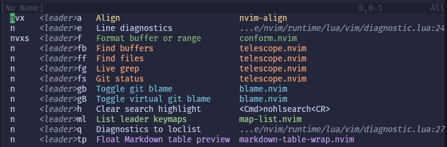

# map-list.nvim
A compact, color-grouped keymap listing for Neovim.

`map-list.nvim` provides `:Map [filter]`, a one-line-per-mapping alternative to
the built-in `:map` output. It shows mode, lhs, description, and source in a
scratch buffer that can be searched normally.



## Features
- Compact one-line keymap rows.
- `:map <leader>`-style filtering.
- `<leader>` and `<localleader>` are dimmed for scanability.
- Buffer-local maps use Neovim's `@` marker on the mode.
- Supported plugin managers show the owning plugin name when available.
- Lua callbacks fall back to trimmed `file:line` source references.
- Plugin-owned rows are color-grouped using colors derived from the active
  colorscheme. *(color grouping algorithm inspired by [blame.nvim])*

## Installation
With lazy.nvim:
```lua
{
	"cmtonkinson/map-list.nvim",
}
```

The plugin only creates the `:Map` user command. If you want a keybind, you can
add it. I have mine mapped to `<leader>ml`:
```lua
vim.keymap.set("n", "<leader>ml", "<cmd>Map <lt>leader><CR>", {
	desc = "List leader keymaps",
})
```

## Usage
```vim
:Map
:Map <leader>
:Map rename
```

## Configuration
Defaults:
```lua
require("map-list").setup({
	command = "Map",
	color = true,
	output = "buffer",
	window_command = "botright new",
	buffer_name = "Keymaps",
	include_buffer_local = true,
	buffer_local_marker = "@",
	modes = { "n", "v", "x", "s", "o", "i", "c", "t" },
	colors = {
		min_normal_distance = 45,
		min_comment_distance = 35,
		min_background_contrast = 2.0,
	},
})
```

Options:

| Name                             | Default                                      | Description                                                                                                               |
|----------------------------------|----------------------------------------------|---------------------------------------------------------------------------------------------------------------------------|
| `command`                        | `"Map"`                                      | User command name. The default creates `:Map [filter]`; set this to rename the command, such as `"Keymaps"`.              |
| `color`                          | `true`                                       | Add highlight groups/extmarks for plugin source groups, callback sources, and leader text.                                |
| `output`                         | `"buffer"`                                   | Render target. Use `"buffer"` for the scratch buffer or `"messages"` for command-line message output similar to `:map`.   |
| `window_command`                 | `"botright new"`                             | Command used to open the scratch buffer when `output = "buffer"`.                                                         |
| `buffer_name`                    | `"Keymaps"`                                  | Scratch buffer name.                                                                                                      |
| `include_buffer_local`           | `true`                                       | Include mappings local to the current buffer.                                                                             |
| `buffer_local_marker`            | `"@"`                                        | Suffix added to the mode label for buffer-local mappings.                                                                 |
| `modes`                          | `{ "n", "v", "x", "s", "o", "i", "c", "t" }` | Ordered modes to collect. Entries can be mode strings such as `"n"`, or tables such as `{ key = "n", label = "normal" }`. |
| `colors.min_normal_distance`     | `45`                                         | Minimum RGB distance between a plugin color and the active `Normal` foreground.                                           |
| `colors.min_comment_distance`    | `35`                                         | Minimum RGB distance between a plugin color and the active `Comment` foreground.                                          |
| `colors.min_background_contrast` | `2.0`                                        | Minimum contrast ratio between a plugin color and the active `Normal` background.                                         |

Source resolution is fixed and automatic:

| Order | Source             | Description                                  |
|-------|--------------------|----------------------------------------------|
| 1     | Plugin manager     | Auto-detected lazy.nvim, vim-plug, or packer plugin ownership. |
| 2     | Lua callback       | Lua callback `file:line` via debug metadata. |
| 3     | Right-hand side    | Command/string RHS fallback.                 |

## Testing
Run the headless test suite from the repository root:
```sh
make test
```

For manual testing against real plugin managers, isolated profile entrypoint
scripts are available. Each launcher starts Neovim with its own XDG
config/data/state/cache directories and installs a small shared plugin set for
checking `:Map <leader>` with themed source grouping.
```sh
./manual/lazy/start
./manual/vim-plug/start
./manual/packer/start
```


[blame.nvim]: https://github.com/FabijanZulj/blame.nvim
